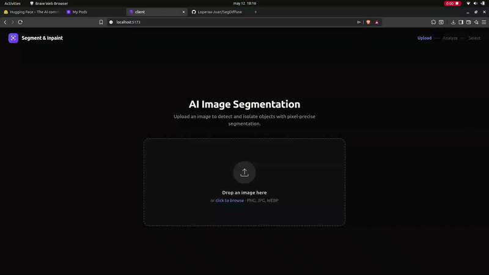
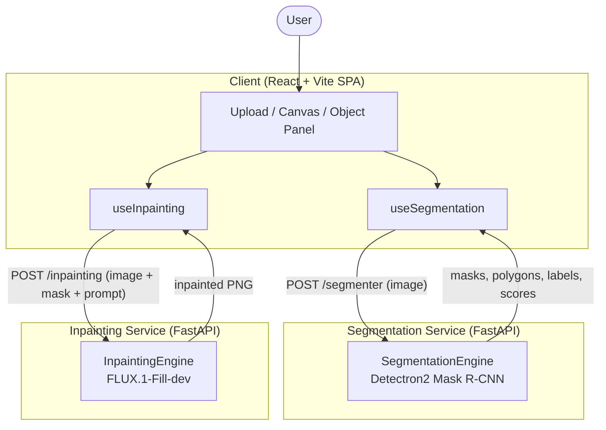
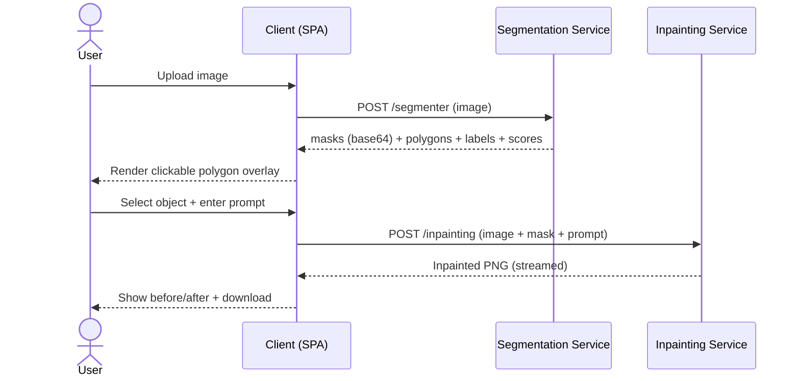

<div align="center">

# 🎨 SegDiffuse

### AI-powered image segmentation & inpainting

**Select any object in a photo and replace it with AI-generated content from a text prompt.**

SegDiffuse combines instance segmentation (Detectron2 / Mask R-CNN) with generative
inpainting (FLUX.1-Fill-dev) behind a modern React interface.

<br />

<!-- Tech stack -->


<br />


<br />

</div>

---

## 📑 Table of Contents

| &nbsp; | &nbsp; |
|---|---|
| [🔎 Overview](#-overview) | [🔧 Configuration](#-configuration) |
| [🖼️ Demo](#-demo) | [🚀 Usage](#-usage) |
| [✨ Features](#-features) | [💡 Examples](#-examples) |
| [🏗️ Architecture](#-architecture) | [🛠️ Development](#-development) |
| [🧰 Technology Stack](#-technology-stack) | [🐳 Deployment](#-deployment) |
| [📁 Project Structure](#-project-structure) | [⚡ Performance Notes](#-performance-notes) |
| [⚙️ How It Works](#-how-it-works) | [🙏 Acknowledgments](#-acknowledgments) |
| [📦 Installation](#-installation) | &nbsp; |

---

## 🖼️ Demo

<div align="center">
  
</div>

---

## 🔎 Overview

- **What it does:** Detects objects in an uploaded image, lets the user select a single object by clicking its polygon, then regenerates the masked region using a text-to-image inpainting model.
- **The problem it solves:** Object-aware image editing normally requires manual masking in tools like Photoshop. SegDiffuse automates mask creation through instance segmentation and pairs it with prompt-driven inpainting, so replacing an object becomes a point-and-describe operation.
- **Who it is for:** Developers, ML practitioners, and creators who want a self-hostable, microservice-based reference for combining segmentation and diffusion inpainting.
- **Key capabilities:**
  - Instance segmentation with per-object masks, labels, confidence scores, and polygon outlines.
  - Interactive object selection on an SVG polygon overlay.
  - Prompt-driven inpainting of the selected object.
  - Side-by-side original/result comparison and PNG download of the result.
  - Light/dark theme with a guided multi-step workflow UI.

---

## ✨ Features

- **Object detection & instance segmentation** — Mask R-CNN (R50-FPN, COCO) via Detectron2 returns masks, class labels, confidence scores, and simplified polygons.
- **Polygon-based object selection** — Each detected object is rendered as a clickable polygon overlay; selection state drives the workflow.
- **Generative inpainting** — The selected object's binary mask plus a user prompt are sent to a FLUX.1-Fill-dev pipeline that regenerates the region.
- **Multi-step guided UI** — A phase indicator walks the user through Upload → Analyze → Select → Inpaint.
- **Result comparison & download** — View the inpainted output and download it as a PNG (`inpainted-<objectId>.png`).
- **Theme support** — Dark/light mode persisted in `localStorage` with system-preference fallback.
- **Health endpoints** — Both services expose `/health` for GCP/Kubernetes readiness checks.
- **Auto-generated API docs** — FastAPI serves interactive Swagger UI at `/docs` (the service root redirects there).

---

## 🏗️ Architecture

SegDiffuse is composed of three independently deployable parts: a frontend single-page application and two FastAPI microservices, each wrapping a GPU model.



**Interaction summary**

1. The client uploads an image to the **segmentation service**, which returns base64 PNG masks plus polygon/label/score metadata.
2. The user selects an object; the client takes that object's mask and the original image and posts them, with a prompt, to the **inpainting service**.
3. The inpainting service streams back a single PNG, which the client displays and offers for download.

The two services are decoupled and addressed by separate base URLs, so they can run on different hosts (the inpainting service in particular is GPU-heavy and is configured by default to point at a remote RunPod proxy — see [Configuration](#-configuration)).

### Request lifecycle



---

## 🧰 Technology Stack

| Category | Technologies |
|----------|--------------|
| **Frontend** | React 19, TypeScript, Vite 8, Tailwind CSS 3, PostCSS, Autoprefixer |
| **Backend** | Python 3.11, FastAPI, Uvicorn, Pydantic / pydantic-settings, python-multipart |
| **AI / Machine Learning** | Detectron2 (Mask R-CNN R50-FPN, COCO), PyTorch, torchvision, Hugging Face Diffusers (`FluxFillPipeline`), Transformers, Accelerate, xFormers |
| **Image Processing** | Pillow, OpenCV (`opencv-python-headless`), NumPy |
| **Infrastructure** | Docker (multi-stage builds), NVIDIA CUDA 12.1 base images, RunPod (remote GPU host referenced by default config) |
| **DevOps / Tooling** | ESLint, TypeScript compiler (`tsc`), Vite build pipeline |
| **Exploration** | Jupyter notebooks (Detectron2, Stable Diffusion, inpainting experiments) |

> **Testing:** No automated test suite is present in the repository. *Needs clarification.*

---

## 📁 Project Structure

```
SegDiffuse/
├── client/                         # React + Vite + TypeScript frontend (SPA)
│   ├── src/
│   │   ├── components/             # UI: UploadArea, SegmentationCanvas, PolygonOverlay,
│   │   │                           #     ObjectPanel, InpaintPromptModal, InpaintingResultView
│   │   ├── hooks/                  # useSegmentation, useInpainting, useImageSize
│   │   ├── utils/                  # colors, geometry (point-in-polygon, centroid, SVG points)
│   │   ├── types/                  # Shared TypeScript types (segmentation.ts)
│   │   ├── App.tsx                 # Workflow/state machine and layout
│   │   └── main.tsx                # App entry point
│   ├── .env.example                # Frontend environment variables
│   └── package.json
│
├── services/
│   ├── segmentation-service/       # FastAPI microservice — Detectron2 instance segmentation
│   │   ├── config/service/settings.py
│   │   ├── src/
│   │   │   ├── inference/engine.py # SegmentationEngine (model load + predict)
│   │   │   ├── server/app.py       # FastAPI app, /segmenter and /health endpoints
│   │   │   └── models.py           # Pydantic / dataclass response models
│   │   ├── Dockerfile              # CUDA multi-stage build
│   │   └── requirements.txt
│   │
│   └── inpainting-service/         # FastAPI microservice — FLUX.1-Fill-dev inpainting
│       ├── config/service/settings.py
│       ├── src/
│       │   ├── inference/engine.py # InpaintingEngine (FluxFillPipeline)
│       │   ├── server/app.py       # FastAPI app, /inpainting and /health endpoints
│       │   └── models.py
│       ├── example.py              # Standalone FLUX.1-Fill-dev usage example
│       ├── Dockerfile
│       └── requirements.txt
│
└── notebooks/                      # Exploration notebooks (Detectron2, Stable Diffusion, inpainting)
```

---

## ⚙️ How It Works

The frontend (`client/src/App.tsx`) is a phase-driven state machine. Each phase corresponds to a step in the editing pipeline:

1. **Upload** — The user drops or selects an image (`UploadArea`). A local object URL is created for preview.
2. **Preview → Analyze** — On "Analyze image", `useSegmentation` posts the file as `multipart/form-data` to `POST /segmenter`. The segmentation service:
   - Decodes the image, runs Detectron2's `DefaultPredictor`, and extracts per-instance masks.
   - Converts each mask to a PNG and base64-encodes it; derives a simplified polygon via OpenCV contour detection (`cv2.approxPolyDP`).
   - Returns `num_objects`, `labels`, `scores`, `class_names`, `masks` (base64), and `polygons`.
3. **Segmented** — The client maps the response into `DetectedObject`s, assigning each a color and computing a polygon centroid. `SegmentationCanvas` / `PolygonOverlay` render clickable polygons over the image.
4. **Select** — The user clicks a polygon (or an entry in `ObjectPanel`) to select a single object.
5. **Prompting** — `InpaintPromptModal` collects a free-text prompt describing the replacement.
6. **Inpaint** — `useInpainting` converts the selected object's base64 mask back into a PNG blob and posts the original image + mask + prompt to `POST /inpainting`. The inpainting service:
   - Loads `FluxFillPipeline` (FLUX.1-Fill-dev) in `bfloat16` and resizes image/mask to the configured dimensions.
   - Runs the pipeline with the configured guidance scale, inference steps, and a fixed seed, then resizes the output back to the original dimensions.
   - Streams the result back as a PNG.
7. **Inpainted** — `InpaintingResultView` shows the result alongside the original and offers a PNG download.

---

## 📦 Installation

### Prerequisites

| Requirement | Notes |
|-------------|-------|
| **Node.js** (with npm) | Frontend tooling. |
| **Python 3.11** | Backend services. |
| **NVIDIA GPU + CUDA 12.1** | Strongly recommended. Both engines fall back to CPU if CUDA is unavailable, but inference will be impractically slow (and the inpainting model is large). |
| **Hugging Face account & token** | Access to the gated [`black-forest-labs/FLUX.1-Fill-dev`](https://huggingface.co/black-forest-labs/FLUX.1-Fill-dev) model. |
| **Docker** *(optional)* | With the NVIDIA Container Toolkit, for containerized deployment. |

### 1. Clone the repository

```bash
git clone https://github.com/Loperaa-Juan/SegDiffuse.git
cd SegDiffuse
```

### 2. Frontend

```bash
cd client
npm install
cp .env.example .env   # then edit the values (see Configuration)
npm run dev
```

The dev server starts on Vite's default port (`http://localhost:5173`).

### 3. Segmentation service

```bash
cd services/segmentation-service
python -m venv .venv && source .venv/bin/activate   # Windows: .venv\Scripts\activate
pip install --upgrade pip

# Install PyTorch matching your CUDA version, then the service deps:
pip install --extra-index-url https://download.pytorch.org/whl/cu121 torch torchvision torchaudio
pip install -r requirements.txt

# Detectron2 is installed from source (see the Dockerfile for reference):
pip install --no-build-isolation 'git+https://github.com/facebookresearch/detectron2.git'

uvicorn src.server.app:app --host 0.0.0.0 --port 8080
```

### 4. Inpainting service

```bash
cd services/inpainting-service
python -m venv .venv && source .venv/bin/activate   # Windows: .venv\Scripts\activate
pip install --upgrade pip
pip install --extra-index-url https://download.pytorch.org/whl/cu121 -r requirements.txt

export HF_TOKEN=hf_your_token_here   # required for the gated FLUX model
uvicorn src.server.app:app --host 0.0.0.0 --port 8080
```

> **Note:** Both services run `uvicorn src.server.app:app` and rely on `PYTHONPATH` including the service root (the Dockerfiles set `PYTHONPATH=/app`). Run uvicorn from the service directory.

---

## 🔧 Configuration

### Frontend (`client/.env`)

| Variable | Required | Default | Description |
|----------|----------|---------|-------------|
| `VITE_API_BASE_URL` | No | `http://localhost:8000` | Base URL of the segmentation service. |
| `VITE_INPAINTING_API_BASE_URL` | No | `https://zdru771une13bi-8000.proxy.runpod.net` | Base URL of the inpainting service (defaults to a remote RunPod proxy). |

> ⚠️ **Port mismatch to be aware of:** The frontend defaults to port `8000`, while the services (settings + Dockerfiles) default to port `8080`. Set `VITE_API_BASE_URL` / `VITE_INPAINTING_API_BASE_URL` explicitly to match where you actually run the services.

### Segmentation service (`config/service/settings.py`, override via environment variables)

| Variable | Required | Default | Description |
|----------|----------|---------|-------------|
| `SEGMENTATION_MODEL_CONFIG` | No | `COCO-InstanceSegmentation/mask_rcnn_R_50_FPN_3x.yaml` | Detectron2 model-zoo config file. |
| `MODEL_WEIGHTS` | No | `COCO-InstanceSegmentation/mask_rcnn_R_50_FPN_3x.yaml` | Detectron2 model-zoo checkpoint reference. |
| `SERVICE_NAME` | No | `segementation_service` | Service name (reported by `/health`). |
| `HOST` | No | `0.0.0.0` | Bind host. |
| `PORT` | No | `8080` | Bind port. |
| `LOG_LEVEL` | No | `INFO` | Logging level. |
| `DEVICE` | No | `cuda:0` | Inference device (falls back to CPU if CUDA is unavailable). |
| `IMG_SIZE` | No | `640` | Image size setting. |
| `CONFIDENCE_THRESHOLD` | No | `0.55` | Minimum detection score (`ROI_HEADS.SCORE_THRESH_TEST`). |

### Inpainting service (`config/service/settings.py`, override via environment variables)

| Variable | Required | Default | Description |
|----------|----------|---------|-------------|
| `HF_TOKEN` | **Yes** (for gated model download) | `None` | Hugging Face token; without it, downloading FLUX.1-Fill-dev fails. |
| `SERVICE_NAME` | No | `inpainting_service` | Service name (reported by `/health`). |
| `HOST` | No | `0.0.0.0` | Bind host. |
| `PORT` | No | `8080` | Bind port. |
| `LOG_LEVEL` | No | `INFO` | Logging level. |
| `DEVICE` | No | `cuda:0` | Inference device (falls back to CPU if CUDA is unavailable). |
| `MODEL_PATH` | No | `black-forest-labs/FLUX.1-Fill-dev` | Diffusers model identifier. |
| `IMG_WIDTH` | No | `720` | Width images/masks are resized to before inference. |
| `IMG_HEIGHT` | No | `720` | Height images/masks are resized to before inference. |
| `GUIDANCE_SCALE` | No | `30.0` | Diffusion guidance scale. |
| `NUM_INFERENCE_STEPS` | No | `20` | Number of diffusion steps. |
| `MAX_SEQUENCE_LENGTH` | No | `512` | Max prompt token sequence length. |
| `DEFAULT_PROMPT` | No | `""` (empty) | Prompt used if the request omits one. |

> Settings use `pydantic-settings`, so each field can be overridden with an environment variable of the same name (case-insensitive). The Docker `CMD` also honors `PORT` (defaulting to `8080`).

---

## 🚀 Usage

### Running the full stack locally

1. Start the **segmentation service** (port `8080`).
2. Start the **inpainting service** (port `8080`, on a separate host/port, with `HF_TOKEN` set).
3. Configure `client/.env` so `VITE_API_BASE_URL` and `VITE_INPAINTING_API_BASE_URL` point at those services.
4. Run `npm run dev` in `client/` and open the printed URL.

### API reference

Each service exposes interactive docs at its root (`/`, which redirects to `/docs`).

#### Segmentation — `POST /segmenter`

```bash
curl -X POST http://localhost:8080/segmenter \
  -F "file=@input.jpg"
```

Response (`application/json`):

```json
{
  "num_objects": 2,
  "labels": [0, 56],
  "scores": [0.98, 0.81],
  "class_names": ["person", "chair"],
  "masks": ["<base64-png>", "<base64-png>"],
  "polygons": [[[x, y], ...], [[x, y], ...]]
}
```

#### Inpainting — `POST /inpainting`

```bash
curl -X POST http://localhost:8080/inpainting \
  -F "file=@input.jpg" \
  -F "mask=@mask.png" \
  -F "prompt=a vase of red tulips on a wooden table" \
  --output result.png
```

Response: a streamed `image/png`.

#### Health checks — `GET /health`

```bash
curl http://localhost:8080/health
# {"status":"ok","service":"...","model":"...","device":"cuda:0"}
```

---

## 💡 Examples

**End-to-end via the UI**

1. Upload a photo of a living room.
2. Click **Analyze image** — the couch, lamp, and table are outlined as polygons.
3. Click the lamp's polygon, then **Inpaint**.
4. Enter a prompt such as `a tall modern floor lamp with a black shade`.
5. Review the before/after comparison and download the PNG.

**Standalone inpainting (no services)**

`services/inpainting-service/example.py` demonstrates `FluxFillPipeline` directly against sample Hugging Face images:

```bash
cd services/inpainting-service
python example.py   # writes flux-fill-dev.png
```

---

## 🛠️ Development

- **Frontend workflow:** `npm run dev` (Vite dev server with HMR), `npm run build` (`tsc -b && vite build`), `npm run preview` (serve the production build).
- **Linting:** `npm run lint` runs ESLint (configured in `client/eslint.config.js` with `typescript-eslint`, `eslint-plugin-react-hooks`, and `eslint-plugin-react-refresh`).
- **Type checking:** Handled by the TypeScript compiler as part of `npm run build`.
- **Backend services:** Run with `uvicorn src.server.app:app --reload` during development. Settings can be overridden via environment variables or a `.env` file (loaded by `pydantic-settings` / `python-dotenv`).
- **Notebooks:** `notebooks/` contains exploratory work for Detectron2, Stable Diffusion, and inpainting.

> No linters/formatters or test runners are configured for the Python services in the repository. *Needs clarification.*

---

## 🐳 Deployment

Both services ship with multi-stage Dockerfiles producing slim runtime images that serve via Uvicorn on port `8080`.

- **Segmentation service** — built on `nvidia/cuda:12.1.0-cudnn8-*-ubuntu22.04`, installs PyTorch (CUDA 12.1) and compiles Detectron2 from source.
- **Inpainting service** — built on `python:3.11-slim`, installs CUDA-enabled PyTorch and Diffusers; requires `HF_TOKEN` at runtime to pull the gated FLUX model.

```bash
# Segmentation service
cd services/segmentation-service
docker build -t segdiffuse-segmentation .
docker run --gpus all -p 8080:8080 segdiffuse-segmentation

# Inpainting service
cd services/inpainting-service
docker build -t segdiffuse-inpainting .
docker run --gpus all -e HF_TOKEN=hf_xxx -p 8081:8080 segdiffuse-inpainting
```

The frontend builds to static assets (`npm run build` → `dist/`) and can be served by any static host or CDN. The `/health` endpoints and `PORT` env handling indicate the services are intended for GCP/Kubernetes-style orchestrated deployments; the default inpainting base URL points at a RunPod GPU proxy.

> No `docker-compose`, Kubernetes manifests, or CI/CD pipelines are included in the repository. 

---

## ⚡ Performance Notes

- **Model loading is front-loaded:** Both services load their model at startup via FastAPI's `lifespan` handler and inject it into `app.state`, so requests don't pay model-load latency. `/health` reports `not_ready` until the model is in memory.
- **GPU expectations:** The inpainting model runs in `bfloat16` and enables `xformers` memory-efficient attention; the UI warns inpainting may take ~30s. Segmentation uses Mask R-CNN R50-FPN.
- **Deterministic inpainting:** A fixed seed (`manual_seed(0)`) is used, so identical inputs produce identical outputs.
- **Image resizing:** Inpainting resizes inputs to `IMG_WIDTH × IMG_HEIGHT` (default 720×720) before inference and restores the original size afterward, bounding compute regardless of input resolution.
- **CPU fallback:** Both engines fall back to CPU when CUDA is unavailable — functional but very slow for these models.

---

## 🙏 Acknowledgments

SegDiffuse builds on the work of the open-source and research community:

- [**Detectron2**](https://github.com/facebookresearch/detectron2) — Meta AI's instance-segmentation framework (Mask R-CNN).
- [**FLUX.1-Fill-dev**](https://huggingface.co/black-forest-labs/FLUX.1-Fill-dev) — Black Forest Labs' generative inpainting model.
- [**Hugging Face Diffusers**](https://github.com/huggingface/diffusers) — diffusion pipeline tooling (`FluxFillPipeline`).
- [**FastAPI**](https://fastapi.tiangolo.com/) · [**React**](https://react.dev/) · [**Vite**](https://vite.dev/) · [**Tailwind CSS**](https://tailwindcss.com/) — application framework foundations.

> **Model licenses:** FLUX.1-Fill-dev is a **gated** model distributed under its own non-commercial license, and
> Detectron2 model weights carry their respective licenses. Review and comply with each upstream license before
> any commercial use.

